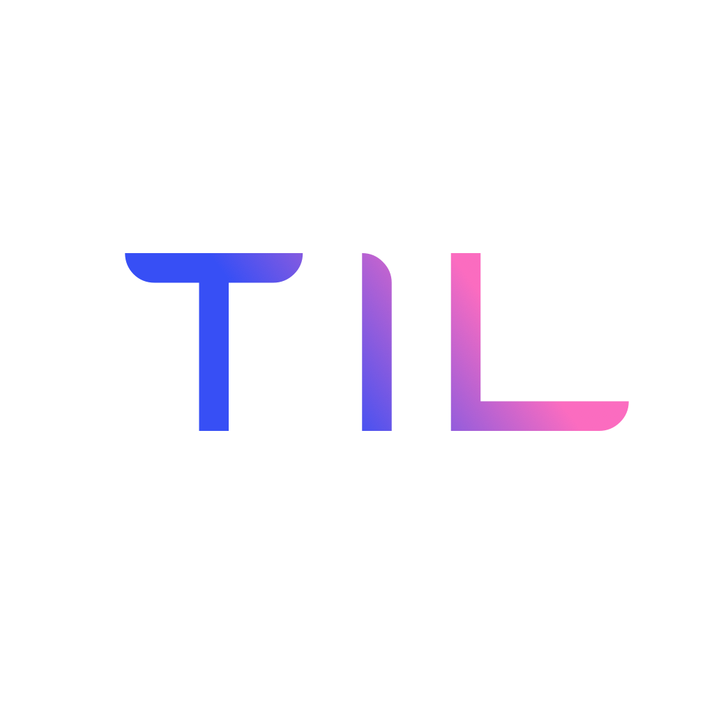
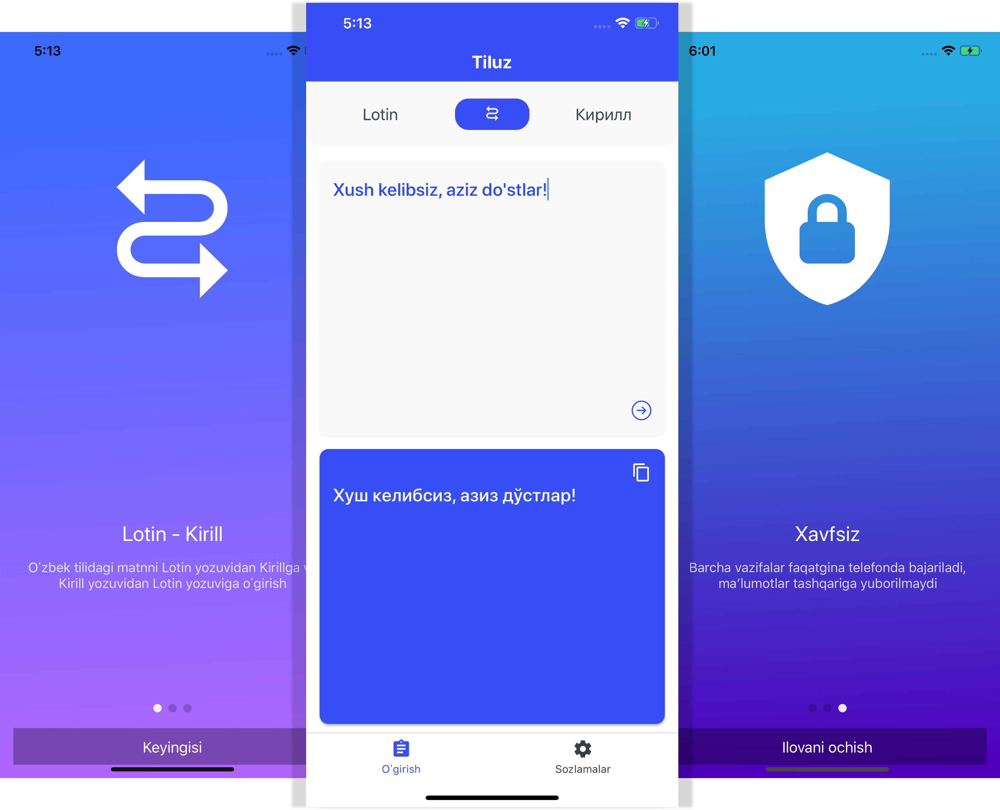

# Tiluz

  

<h3 align="center">
  Tiluz
</h3>

  Uzbek language Latin - Cyrillic Transliterator

## What can Tiluz do?

**Convert Latin script written in Uzbek language to Cyrillic script, and vice-versa**

Uzbekistan has two active alphabet scripts. Latin script is the official one, and the country is actively switching to it from Cyrillic script. Created this app for personal use first.

- Users can **write or paste** text in the app
- **Copy** transliterated text to clipboard
- **Offline**, no internet needed

  

    
  

### [Demo - Try it on Expo](https://expo.io/@jkhusanov/Tiluz)

### TODO

- [x] Design, build, and implement screens' functionality
- [x] One time onboard Swipe
- [x] Create logo, and add it
- [x] Change app store links
- [x] Publish on app stores
